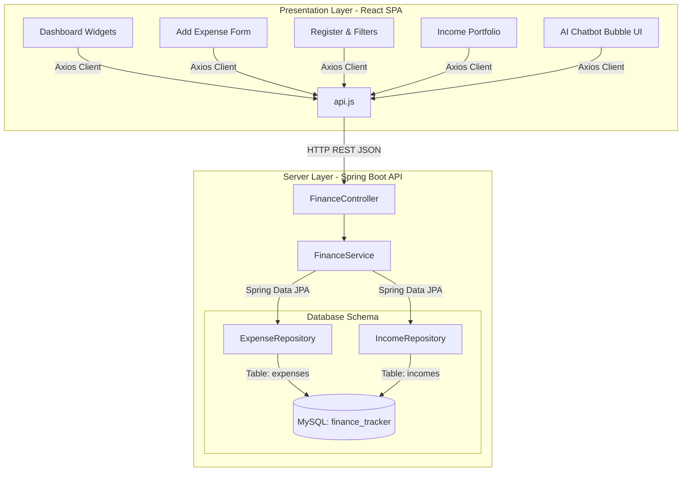

# 🏦 FinVibe - Modern Personal Finance & Expense Tracker

FinVibe is a state-of-the-art, responsive **Personal Finance & Expense Tracker** web application designed to empower users to manage their net worth, visualize spending habits, and interact with a live database ledger through a built-in **AI Chatbot Assistant**. 

The application is architected with a decoupled industry-standard stack: a robust **Spring Boot REST API** backend serving a rich, fluid **Vite React + Tailwind CSS** single-page application frontend, with **MySQL** as the primary datastore. All transactions and chatbot aggregates natively utilize the **Indian Rupee (₹)** currency symbol.

---

## 📸 Application Preview & Visuals

FinVibe features a premium, responsive glassmorphism UI with a custom sidebar, dynamic hover transitions, micro-animations, and complete custom dashboard widgets.

* **Top-tier KPI Cards**: Instantly monitor Net Balance (₹), Total Earnings, Total Expenses, and weekly/monthly projections.
* **Data Visualization**: Real-time category-wise spending breakups using interactive Pie Charts and Weekly Expense Bar Charts powered by Recharts.
* **Instant Purging & Filters**: Search, filter by dates, and immediately delete entries from your Ledger records.
* **Interactive Chat Assistant**: WhatsApp-style smooth chat bubble screen supporting live context queries.

---

## 🏗️ System Architecture

FinVibe is designed using clean separation of concerns, decoupling the Presentation Layer (React SPA) from the Business and Persistence Layers (Spring Boot + JPA Hibernate).



---

## 🛠️ Technology Stack

### **Frontend Client**
* **Framework**: React 19 (Vite SPA template)
* **Styling**: Vanilla CSS custom variables + Tailwind CSS v3
* **Charts**: Recharts (Responsive Container, Tooltips, Custom Legend, Cell mapping)
* **Icons**: Lucide React
* **API Connector**: Axios (Global instance client with pre-configured bases)

### **Backend Server**
* **Framework**: Spring Boot 3.x
* **Data Persistence**: Spring Data JPA / Hibernate
* **Language & Build**: Java 17+, Maven Wrapper
* **Utilities**: Lombok (Boilerplate reduction for DTOs and Entities)
* **Database**: MySQL 8.x

---

## 🚀 Quick Start & Installation

Follow these steps to spin up the development environment on your local system.

### **Prerequisites**
Make sure you have the following installed:
* **Java SDK 17 or higher**
* **Node.js (v18 or higher) & npm**
* **MySQL Server** running on `localhost:3306`

---

### **Step 1: Set Up MySQL Database**

Open your MySQL terminal or database client and execute:

```sql
CREATE DATABASE finance_tracker;
```

*Note: The application automatically creates and maps the database tables (`expenses` and `incomes`) on bootup through Hibernate's DDL configuration.*

---

### **Step 2: Boot the Spring Boot Backend**

1. Open your terminal and navigate to the backend subdirectory:
   ```bash
   cd backend
   ```
2. Make sure the database credentials inside `backend/src/main/resources/application.properties` match your local MySQL server setup (default is username `root` with no password).
3. Start the application using the Maven wrapper:
   ```bash
   ./mvnw spring-boot:run
   ```
4. The server will boot up and bind to **`http://localhost:8080`**.

---

### **Step 3: Boot the React Frontend Client**

1. Open a new terminal window and navigate to the frontend subdirectory:
   ```bash
   cd frontend
   ```
2. Install all node packages and dependencies:
   ```bash
   npm install
   ```
3. Run the hot-reloading development server:
   ```bash
   npm run dev
   ```
4. Click or open **`http://localhost:5173`** in your browser.

---

## 💬 AI Chatbot Queries

FinVibe includes an interactive, WhatsApp-style AI Finance Assistant. You can click on the preset quick-action chips or type queries directly.

The backend chatbot engine parses queries deterministically. Try asking:

| Query Example | Chatbot Response & Logic |
|---|---|
| **"What is my current balance?"** | Calculates `Total Income - Total Expense` and returns: <br> `🏦 Your current balance is ₹XXXX.XX` |
| **"What is my total expense today?"** | Aggregates all expenses with the current date: <br> `💵 Your total expense today (Date) is ₹XXXX.XX` |
| **"Show weekly expense"** | Sums up all expenses incurred in the last 7 days: <br> `📊 Your total expense for the last 7 days is ₹XXXX.XX` |
| **"Last transaction"** | Compares dates from latest incomes and expenses, returning: <br> `💸 Your latest transaction is an Expense: ...` or `💰 ... Income: ...` |

---

## 🔌 API Endpoints Reference

All requests and responses are standard JSON formatted payloads.

### **Expenses API**
* `GET /api/expenses` — Retrieves all expenses, ordered chronologically (newest first).
* `POST /api/expenses` — Saves a new expense transaction.
  * *Request Body:*
    ```json
    {
      "amount": 2500.00,
      "category": "Rent",
      "description": "Appartement rental",
      "date": "2026-05-23"
    }
    ```
* `DELETE /api/expenses/{id}` — Removes an expense from the database register.

### **Income API**
* `GET /api/income` — Retrieves all logged earnings, ordered chronologically.
* `POST /api/income` — Log a new income transaction.
  * *Request Body:*
    ```json
    {
      "amount": 75000.00,
      "source": "Monthly Salary Credit",
      "date": "2026-05-23"
    }
    ```
* `DELETE /api/income/{id}` — Purges an income entry.

### **Dashboard & Chatbot Aggregates**
* `GET /api/dashboard/summary` — Returns key dashboard statistics:
  ```json
  {
    "totalBalance": 72500.00,
    "totalIncome": 75000.00,
    "totalExpense": 2500.00,
    "weeklyExpense": 2500.00,
    "monthlyExpense": 2500.00
  }
  ```
* `POST /api/chat` — Submits a user query message to the chatbot.
  * *Request Body:* `{"message": "What is my current balance?"}`
  * *Response:* `{"response": "🏦 Your current balance is **₹72500.00**."}`

---

## 🎨 Design Tokens & UI Features

1. **Colors**: Curated, modern color systems including Indigo gradient panels (`from-blue-600 to-indigo-700`), Emerald tags (`bg-emerald-50 text-emerald-700`) for credits, and Rose highlights for deletions.
2. **Typography**: Google Web Fonts **Plus Jakarta Sans** and **Outfit** for clean visual weight distributions and strong modern typography.
3. **Animations**: Tailored micro-interactions and transitions using keyframe fading styles (`animate-fadeIn` and `duration-250`) to provide instant user feedback without browser lag.
4. **Mobile Layout**: Full hamburger responsive sliding navigation menu using custom state handles for a native application feel.

---

*FinVibe - Code with Premium Aesthetics and Precision Engineering.*
